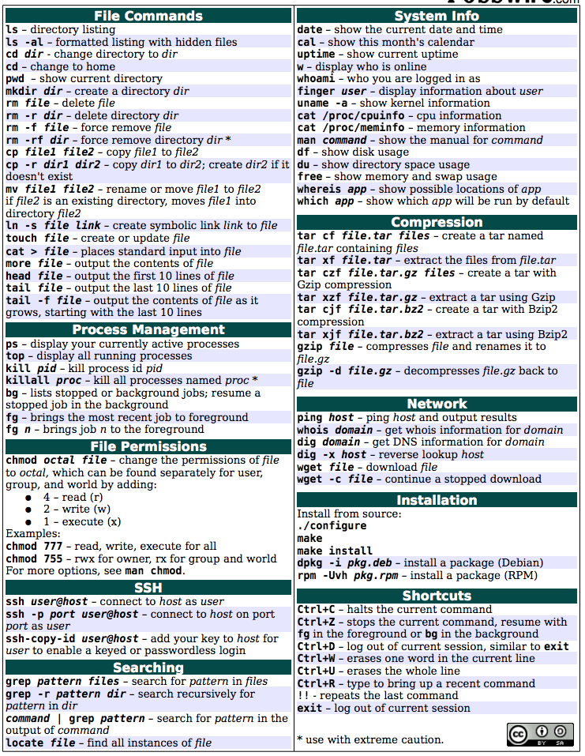

# Console Basics

This section is intended for business apprentices or anyone who has little experience using the terminal. If you already feel you have an understanding of navigating the CLI feel free to skip this section.

1. Assuming you are using a Liatrio Macbook, open terminal through Launchpad.
2. Now use the command "pwd" for "Present working directory." You should see something like "/User/(yourUsername)/" This is your home directory. Use "ls" to see what is in this folder.
3. Now lets create a folder using "mkdir 1.5" and then change into that folder using "cd 1.5".
4. If you use "ls" to look at the contents of your new folder it is looking pretty empty. Let's change that by using "touch Liatrio" and "mkdir newFolder", then using "ls" to show what has been made.
5. Now we are going to use "mv /User/(yourUsername/1.5/Liatrio /User/(yourUsername)/1.5/newFolder/Liatrio" to move your Liatrio file into the new folder. You could also use "cp" if you wanted to copy to a new file instead of moving the old one.
6. Use "ls" to confirm the file is there and then remove the file using "rm Liatrio".
7. Use "cd .." to move one directory back and then use "ls" to confirm the file is gone. Or use "cd" to return to your home directory.
8. Now in your home directory lets remove everything by using "rm -Rf 1.5". The -R flag will apply the action to all of the subfolders and the -f flag forces the action to occur.
9. Now that you have a VERY basic understanding of using the console, review some of the commands above or find videos online. If you are confused about what a command does try using explainshell.com which helps break down commands to make them easier to understand.
10. Finally run "vimtutor" to start your tutorial on vim. Vim is a text editor which will allow you to edit files. At Liatrio you can use whatever text editor. For now, use vim to understand the basics.
